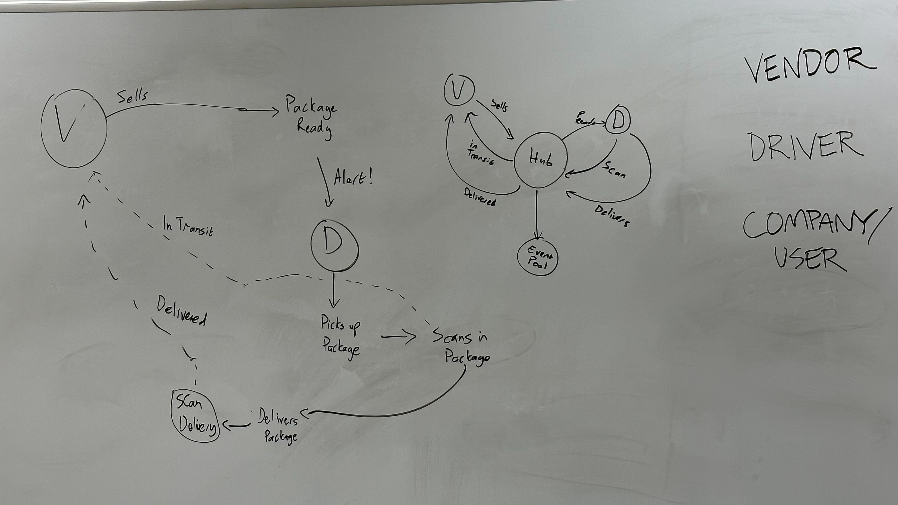

# Event-Driven Server

Socket.IO and Event-driven "Package Delivery Service" Server

## Install instructions:

npm install

## Usage
Server.js should be started before Driver.js, and Vendor.js 

## Dependencies

jest socket.io

## Render.com URL:

## Assignment instructions

## Phase 3
### Overview
The goal of this lab is to create a namespaced Socket.io event server, and to configure Vendor and Driver Client Modules.
The expected output of the 3 running applications is the same as it was in Phase 2.

### Event Hub (Server)
- The Socket Server will create a namespace of caps that will receive all CAPS event traffic.
- Each Vendor and Driver Client will connect to the caps namespace.
- The server will emit specific events to each socket that is listening for their designated events from the Global Event Pool defined in the Server.
- Each Vendor will only emit and listen for specific events based on their Vendor ID. This will be managed by rooms within Socket.io.
- Each Driver will “pick up” a package when the vendor notifies the Server that an “order” is ready and simulate “in-transit” and “delivered” events.

**Use the socket.io npm package to configure an event Server that can be started at a designated port using node.**
**Accept connections on a namespace called caps, and configure socket objects from clients.**
**Ensure that client sockets are connecting to their appropriate room if specified.**

**Configure a Global Event Pool that every client socket should listen for:**
- **pickup** - this will be broadcast to all sockets except the sender.
- **in-transit** - this will be emitted only to Vendors that have joined the appropriate room.
- **delivered** - this will be be emitted only to Vendors that have joined the appropriate room.
NOTE: You may need to create an extra event here that allows clients to join rooms.

### Vendor (Client)
- Connects to the CAPS Application Server using socket.io-client:
- Make sure your module connects to the caps namespace.

- Use the store name **1-206-flowers** to simulate a single vendor
- Upon connection, use the store name as a vendor id to join a room.
- Upon connection, simulate new customer orders:

- Create a payload object with your store name, order id, customer name, and address.
- Emit that message to the CAPS server with an event called pickup.
- Emit in a setInterval() to simulate multiple orders and observe system functionality.

- Listen for the delivered event coming in from the CAPS server.
- Console log: **Thank you for your order <customer-name>.**
- Optionally, you can exit the application using process.exit() or clearInterval(<interval-id>) within a setTimeout() to simulate multiple orders and then stop.

### Driver (Client)
- Connects to the CAPS Application Server using socket.io-client:
- Make sure this module connects to the caps namespace.

- Once connected, the Driver client module should listen for any appropriate events from the Server:
- When a pickup is emitted from the Server, simulate all specified Driver behaviors.

**Simulate the following events and emit payloads to the CAPS Application Server upon receiving a “pickup” event:**
in-transit
- Log “picking up payload.id” to the console.
- emit an in-transit event to the CAPS server with the payload.
delivered
- emit a delivered event to the CAPS server with the payload.

When running, the vendor and driver consoles should show their own logs. Additionally, the CAPS server should be logging everything.
**Server should be started first, then Driver, then Vendor.**

## Phase 2
### Event Hub (Server)
- Implement a Module for a Global Event Pool.
- Export a single EventEmitter from the Node JS module.
- Should be imported by any module that needs to notify or be alerted by other modules of an event.
- Implement a Module for Managing Global Package Events.
- Listens to ALL events in the Event Pool.
- Logs a timestamp and the payload of every event.

### Vendors
- Implement a Module for Managing Vendor Events.
- Your implementation should use a store name as a parameter.
- When triggered, the vendor module simulates a pickup event for the given store name to the Global Event Pool:
- emits pickup to the global event pool.
- sends a vendor order payload:
- Listens for a delivered event and responds by thanking the customer with the console log: Thank you for your order <customer-name>

### Drivers
- Implement a Module for Managing Driver Events.
- Listens for a pickup event from the Global Event Pool and responds with the following:
- Log a message to the console: DRIVER: picked up <ORDER_ID>.
- Emit an in-transit event to the Global Event Pool with the order payload.
- Log a confirmation message to the console: DRIVER: delivered <ORDER_ID>.
- Emit a delivered event to the Global Event Pool with the order payload.

## Whiteboard

#### Tests
**Vendor**
- Should recieve a delivered event, and return a thank you message to the console
- Should call .emit to initiate Pickup event with store name, order, and customer info

**Driver**
- Should listen for Pickup events
- Should emit an in-transit event to the Hub with order payload
- Should emit Delivered event to Hub
